# Design: Co-Optimizing Coding and Review Agents

## TL;DR

Five pieces, plus guardrails to keep them honest.

1. **A test-runner "oracle"** ([harness/oracle.py](../harness/oracle.py)). Runs arrow's own pytest suite after every coder submission. This is the only signal we trust for "did the fix actually work." Hidden from the reviewer.
2. **Git-history retrieval for the coder** ([harness/history.py](../harness/history.py)). Before each issue, grabs up to 3 pre-baseline commits that touched the same files and look topically similar. Gives the coder concrete examples from this repo's past, not just general LLM priors.
3. **A "lessons" notebook for each agent** ([harness/memory.py](../harness/memory.py)). The coder's holds distilled lessons from past fixes that passed the tests. The reviewer's holds calibration examples tagged by whether its verdict agreed with the oracle (a 2x2 win/loss table). Both are capped at a few bullets and stored as plain JSON.
4. **A distillation step** ([harness/distill.py](../harness/distill.py)). After each issue, walks every round. Oracle-passing diffs produce coder lessons (one LLM call). Every round produces a reviewer calibration case (no LLM).
5. **Stability guardrails and real metrics** ([harness/scheduler.py](../harness/scheduler.py), [harness/metrics.py](../harness/metrics.py)). A held-out split that never feeds distillation, alternating updates so the two agents never learn at the same time, and a reviewer audit that freezes the reviewer's notebook if it drifts. Headline metric is oracle-grounded `test_pass_rate`.

We do **not** build: an AlphaGo-style value network, best-of-N candidate ranking, a curriculum, or reviewer-side git-history access. Those are future work.

---

## The problem in one paragraph

Two AI agents work on a software bug. A **Coder** writes a fix. A **Reviewer** approves or rejects it. They go back and forth until the Reviewer is happy. The interesting question: how do we use the back-and-forth conversations to make both agents better over time? The trap: if the Coder only has to please the Reviewer, it can learn to write code that looks plausible but doesn't actually work. The Reviewer might learn to rubber-stamp it in response. We need an outside judge that can't be fooled.

## The big idea

Three pieces working together.

**1. Tests are the anchor.** arrow ships a pytest suite. After every coder submission we secretly run a slice of those tests and record pass or fail. The Reviewer never sees the test result. That secrecy is what stops it from collapsing into a test-runner. Tests are noisy in some ways (they don't catch every bug), but they don't lie about the bugs they do cover.

**2. The coder sees two kinds of extra context; the reviewer sees one.**

- **Coder's git-history block**: up to 3 pre-baseline commits that touched the same files, with a diff excerpt on the top match. The arrow repo has about 800 commits before our baseline, which is a much richer source of concrete examples than waiting to accumulate our own traces. Safety is structural: we only `git log c9cecaf`, so the 25 eval fix commits are literally unreachable (verified 0 of 25 leaks).
- **Coder's notebook**: bullet-point "lessons learned" from past fixes that passed the tests. Tagged by bug category. Capped at about 8 per category.
- **Reviewer's notebook**: examples of times it was right and times it was wrong, organized as a 2x2 win/loss table:

  | Reviewer said | Tests said | What we record |
  |---|---|---|
  | approve | pass | "I was right to approve this kind of fix" |
  | reject | fail | "I was right to catch this kind of bug" |
  | approve | **fail** | "I missed this. Look harder for it next time." |
  | reject | **pass** | "I over-asked. Don't be this picky next time." |

We don't fine-tune anything. The notebooks are JSON files we paste into the system prompt. Cheap, legible, and wipeable in 5 seconds if they go off the rails.

**3. Guardrails to keep both agents from drifting.** See the next section.

## Stopping the four ways this can go wrong

The problem statement names four failure modes. Here's how we defend against each.

**Reward hacking** (Coder games the Reviewer): the coder's notebook is only updated from traces where the *tests* passed. Reviewer approval alone never triggers a lesson. We also track the absolute difference between approval rate and test pass rate, and flag it if the gap exceeds 30%.

**Reviewer collapse** (Reviewer gets too lenient or too strict): after every few issues we audit the reviewer's accuracy against the oracle. If precision drops below 60%, or approval rate saturates above 95% or below 5%, or the balance gap exceeds 30%, we freeze its notebook. No more updates until manually reset.

**Mode collapse** (both narrow into one fragile pattern): whenever we pull lessons for the coder, we always include at least one bullet from a different bug category than the current issue. This forces variety into every prompt.

**Distributional shift** (Reviewer becomes out-of-date as the Coder improves): we update the reviewer's notebook on even-numbered training issues from fresh coder traces, so it keeps pace. The coder is updated on odd-numbered issues. This alternation also stops both agents from learning from the same trace at the same time.

## What signals we actually trust

Not all signals from a trace are equally reliable. We rank them.

| Signal | Reliable? | Used for |
|---|---|---|
| Did the tests pass? | Yes (it's the oracle) | Headline metric, gating coder lessons |
| First-round oracle outcome | Yes | Coder quality without reviewer help |
| Reviewer agreed with tests? | Yes (derived from the oracle) | Reviewer notebook, audit |
| Coder edited the area the reviewer mentioned? | Heuristic | Comment-addressal metric |
| Reviewer approved | **No** by itself | Never train on this alone |
| Coder or reviewer "sounded confident" | No | Ignore |

Anything not grounded in the oracle is treated as suggestive at best.

## Architecture

```mermaid
flowchart TB
    subgraph perIssue [Per-Issue Loop]
        Issue --> Coder
        GitHist[("Git history<br/>pre-baseline only")] -.->|"top-k similar commits"| Coder
        CoderMem[(Coder notebook)] -.->|inject by category| Coder
        Coder -->|diff| OracleNode[Oracle: pytest]
        Coder -->|diff| Reviewer
        ReviewerMem[(Reviewer notebook)] -.-> Reviewer
        OracleNode -->|pass/fail HIDDEN from reviewer| TraceStore[(Trace store)]
        Reviewer -->|approve or reject with comments| TraceStore
        TraceStore --> Decide{approved or max rounds?}
        Decide -->|retry| Coder
    end
    TraceStore --> Distill[Distillation per issue]
    Distill -->|"only if tests passed (odd issue)"| CoderMem
    Distill -->|"2x2 win/loss vs oracle (even issue)"| ReviewerMem
    TraceStore --> Audit[Reviewer audit]
    Audit -->|"if drifting"| FreezeReviewer[Freeze reviewer updates]
    HeldOut[("Held-out issues<br/>no distillation")] --> Distill
```

The most important arrow is the dotted "HIDDEN from reviewer" line. Breaking that (leaking oracle output into the reviewer's prompt) collapses the whole design.

## What we borrow from GANs and AlphaGo

These two frameworks describe versions of the same problem.

**From GANs**: the coder-vs-reviewer setup is literally a generator-vs-discriminator game. The classic GAN failure modes (mode collapse, discriminator collapse) are exactly the pathologies the problem statement names. We borrow three GAN tricks: alternating updates, hiding inputs from one side (asymmetric information), and matched model strength so neither side can dominate.

**From AlphaGo**: self-play only works if there's an objective oracle deciding who won. Go has rules, we have tests. We borrow two ideas: (a) every round of every loop is a labeled training sample, not just the final approval; (b) round-1 outcomes are especially valuable because the coder solved them without reviewer hints.

What we don't borrow: pure self-play with no external truth. AlphaZero can start from random weights because Go's rules are self-contained. LLMs that have no anchor will happily converge to mutually plausible nonsense. Tests are non-negotiable.

## How we measure success

Primary number: **`test_pass_rate` on the held-out issues**. One number, oracle-grounded, cannot be gamed by the agents because they never trained on these.

Side numbers tell us which agent is improving:

- `first_pass_test_pass_rate`: did the coder fix it without any reviewer help?
- `rounds_to_test_pass`: efficiency.
- Reviewer `precision`, `recall`, `false_positive_rate` vs. the oracle: is the reviewer's "approve" actually meaningful?
- `|approval_rate - test_pass_rate|`: reward-hacking detector.

Evaluation: run the same issue stream with and without distillation (ablation). If `test_pass_rate_heldout` improves with distillation and the balance gap stays small, the system worked.

## What's in scope (MVP) vs. future work

**In scope, in the prototype:**

- Test oracle with targeted slice and broader regression check.
- Git-history retrieval for the coder (baseline-scoped, leak-proof).
- Both notebooks, with the 2x2 win/loss table for the reviewer.
- Held-out split, alternating updates, reviewer audit and freeze, category-balanced retrieval.
- Metrics with held-out breakdown and reward-hacking alerts.
- Ablation CLI (`--ablate --no-history`) and parallel runner.

**Future work.** The detailed two-week and two-month roadmap lives in [RESPONSE.md](RESPONSE.md). Headliners:

- Value-function reviewer (AlphaGo-style `P(tests pass)` head).
- Best-of-N candidate diffs ranked by value or reviewer.
- Extending git-history access to the reviewer (git-blame context).
- Cross-repo transfer.
- Mutation testing as a second oracle.
