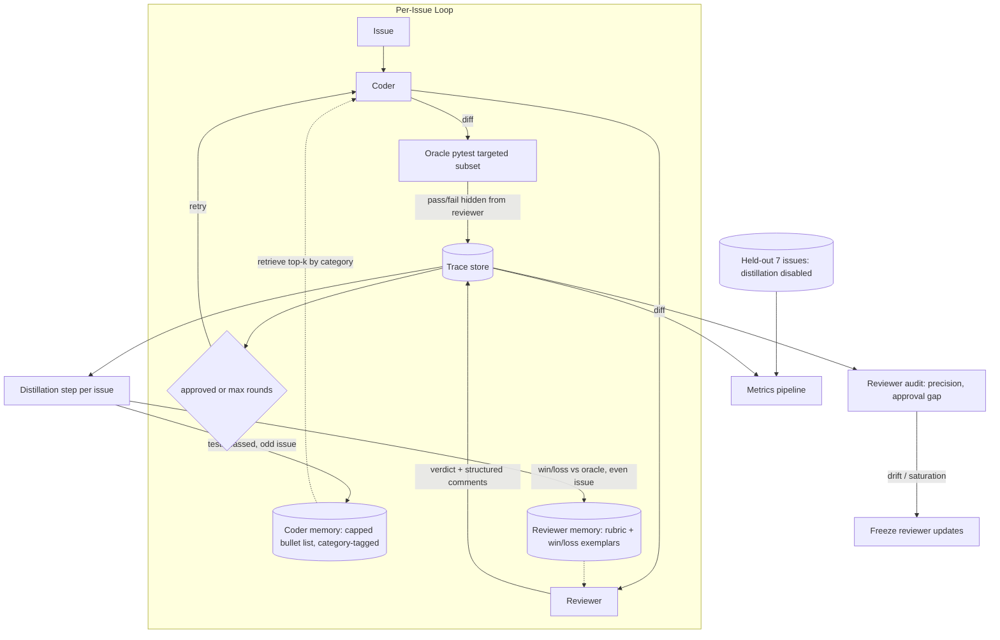

# Design: Co-Optimizing Coding and Review Agents

This is the Part 1 design document for the worktrial. It proposes a concrete mechanism for using interaction traces between a coder agent and a reviewer agent to improve both, without falling into the pathological dynamics the problem statement calls out.

Companion documents:
- [PROBLEM.md](../PROBLEM.md) — original problem statement.
- Implementation plan — `.cursor/plans/co-opt-agents-prototype_*.plan.md`.
- [RESULTS.md](RESULTS.md) — Part 3, written after the prototype runs.

---

## 1. Summary

We extend the starter harness with three additions:

1. **A test-based ground-truth oracle** that runs a targeted subset of arrow's own pytest suite against every coder submission. The oracle is hidden from the reviewer and used (a) as the real evaluation signal, (b) to audit the reviewer, (c) to gate trace usage.
2. **Small, legible memories for both agents** — a capped bullet-list preamble for the coder (lessons learned from past successful fixes) and a rubric + calibration-case pool for the reviewer (cases where its verdict agreed or disagreed with the oracle).
3. **Stability guardrails** — held-out issues, reviewer audit-and-freeze, alternating updates, category-balanced retrieval.

The headline metric is **test pass rate on held-out issues** rolled forward across the training stream. Secondary metrics decompose per-agent quality so we can tell which agent is improving and whether one improves at the other's expense.

---

## 2. Theoretical framing: GANs and self-play

Two prior frameworks describe versions of what the problem is asking for. We borrow selectively from each.

### 2.1 What the problem has in common with GANs

A GAN trains a generator and a discriminator adversarially. The generator wants to produce outputs the discriminator cannot distinguish from real data; the discriminator wants to catch fakes. They co-improve by pressuring each other.

| GAN concept | Mapping to our system |
|---|---|
| Generator | Coder |
| Discriminator | Reviewer |
| "Real" examples | Ground-truth fixes (tests passing) |
| Training signal | Oracle outcomes + discriminator loss |
| Mode collapse | Coder writes a narrow style that the reviewer always approves |
| Discriminator collapse | Reviewer either rubber-stamps or always-rejects |

What the GAN literature tells us we should borrow:
- **Alternating updates** for the two agents to prevent synchronized drift. In our prototype this is a simple parity rule: odd-numbered training issues update the coder's memory, even-numbered issues update the reviewer's memory.
- **Asymmetric information** so one side cannot shortcut the other. The reviewer cannot see the oracle output; the coder cannot see the reviewer's rubric.
- **Balance monitoring.** In GANs, if the discriminator gets too strong the generator's gradient vanishes; if too weak, training explodes. Our equivalent: if approval rate saturates to 0 or 1, the game is degenerate and we freeze updates.

What we do *not* borrow: adversarial reward as the *only* signal. Classic GANs collapse constantly; the field's workaround was to add auxiliary objectives (e.g. Wasserstein distance, feature matching). Our auxiliary objective is the test oracle.

### 2.2 What the problem has in common with AlphaGo

AlphaGo and AlphaZero train a policy and a value network via self-play, grounded in an objective oracle — the rules of Go decide who won, full stop. The key insight is that grounding in an external truth is what makes self-play not collapse; without it, you can converge to any equilibrium.

| AlphaGo concept | Mapping to our system |
|---|---|
| Game | Issue → fix → review loop |
| Win/loss | Tests pass / fail |
| Policy network | Coder |
| Value network | Not built for MVP; stretch goal (§ 8) |
| MCTS rollout | Not built for MVP; stretch goal (§ 8) |
| Replay buffer | Trace store |

What we borrow:
- **Every round is labeled.** AlphaGo does not only learn from the final move of each game — every state-action pair is labeled by the eventual outcome. We similarly treat every round's diff as a training sample, labeled by the oracle at that round. Round 1 diffs are especially valuable because they reflect the coder *without* reviewer contamination; round N diffs reflect post-feedback revision.
- **Explicit win/loss framing.** See § 4.2; we make the reviewer's "did you agree with reality" outcome explicit rather than collapsing it into a vague notion of calibration.
- **Objective anchor.** Tests are the rules of our game. Without them, the system degenerates.

What we do *not* borrow:
- **Pure self-play with no external ground truth.** AlphaZero can start from random weights because Go's rules are self-contained. In our setting, LLMs that have no anchor converge to mutually plausible nonsense. Tests are non-negotiable.
- **Full policy-gradient training.** We use prompt-level distillation into small memories instead — cheaper, legible, reversible in minutes.

### 2.3 What neither framework gives us

Both frameworks assume a fixed game. Ours has a curriculum problem — 25 real bugs, not symmetric rollouts — so we have to also think about *which issue to put in front of the agents next*, how to split into train/held-out, and how to measure improvement on a finite issue stream. That's the "human-in-the-loop-benchmark" shape, and we address it via held-out splits (§ 5).

---

## 3. Data extraction: what signals we get from traces

Every issue produces a trace of the form:

```
Trace = {
  issue, baseline,
  [(round_i_diff, oracle_result_i, reviewer_verdict_i, reviewer_comments_i), ...]
}
```

For each tuple we extract the following signals, ranked by reliability.

### 3.1 Reliable signals (oracle-grounded, train on these)

| Signal | Definition | Why reliable |
|---|---|---|
| `tests_passed(round_i)` | Did pytest pass on the targeted test subset? | Objective; no LLM involved |
| `first_pass_test_pass` | `tests_passed(round_1)` before any reviewer feedback | Isolates coder policy quality |
| `rounds_to_test_pass` | Smallest `i` where `tests_passed`; ∞ otherwise | Loop efficiency, oracle-grounded |
| `reviewer_correct(round_i)` | `approved_i == tests_passed_i` | Reviewer accuracy, grounded per-round |
| `approval_test_gap` | `approval_rate - test_pass_rate` over a window | Reward-hacking detector |

### 3.2 Noisy but useful signals

| Signal | Definition | Failure mode |
|---|---|---|
| `comment_addressal(i, j)` | For each structured comment in review_i with file/region, did diff_j touch that region? | Measures "did the coder respond", not "did it respond correctly" |
| `diff_delta(i, j)` | Character or token-level edit distance between rounds | Crude; any change counts |
| `comment_followed_by_pass` | Comment in round_i, then `tests_passed(round_{i+1})` | Confounded with other factors in the revision |
| Reviewer comment length / specificity | Heuristic on comments | Longer ≠ better |

### 3.3 Unreliable signals (do not train on without anchor)

- **Reviewer approval alone.** By construction this is what we are trying to improve; using it as training signal is reward hacking.
- **"The coder sounded confident."** LLMs hallucinate conviction.
- **"The diff looks similar to other good diffs."** Style matching, not correctness.

### 3.4 Which signals go where

- **Coder memory updates** use only traces where `tests_passed=True`. We never distill a lesson from a fix that looked good but failed tests.
- **Reviewer memory updates** use the per-round agreement/disagreement with the oracle (see § 4.2 win/loss table).
- **Held-out evaluation** uses only `tests_passed` on issues never seen during distillation.

---

## 4. Improvement mechanism

We prompt-engineer both agents via small, capped memory stores rather than fine-tune. Reasons: cheap, legible, reversible, and the sample size (25 issues) is way below what fine-tuning needs to not overfit.

### 4.1 Coder memory: lessons

After every issue where the oracle passed, we extract at most 1-2 bullet "lessons" using a distillation LLM call. Each lesson is:

```json
{
  "id": "...",
  "text": "When the bug involves humanize boundary logic, check constants.py and arrow.py:humanize for the threshold table.",
  "category": "humanize-boundary",
  "source_issue": 1015,
  "uses": 3,
  "hits": 2
}
```

At coder invocation time, we retrieve:
- Top 2 lessons matching the current issue's inferred category.
- 1 lesson from a *different* category (diversity anchor — prevents topic collapse).

Categories are inferred from a keyword match over `title + body_summary` combined with `files_changed` hints in `data/issues.json`. The initial category set is the five already present in the dataset (humanize boundary, missing locale timeframe, locale pluralization, parsing edge case, DST/range/escaping).

Memory is capped at ~8 items per category, evicted by `uses - hits` (items that never get retrieved or never help go first).

### 4.2 Reviewer memory: win/loss table

After every round, the reviewer has one of four outcomes against the oracle:

| Reviewer verdict | Oracle | Outcome | Memory action |
|---|---|---|---|
| approve | pass  | WIN (true approval) | Store as a "good-to-approve" exemplar |
| reject  | fail  | WIN (true rejection) | Store comment pattern as "caught a real bug" |
| approve | fail  | LOSS (false approval) | Store as "I missed this" calibration case |
| reject  | pass  | LOSS (false rejection) | Store as "I over-asked" calibration case |

Each stored item is 1-2 sentences plus the raw diff snippet. At reviewer invocation time we inject:
- 1 WIN example of each type if available.
- 1 LOSS example of each type if available.

This gives the reviewer up to 4 calibration examples per run — enough for the prompt to change behavior, small enough not to pollute context.

### 4.3 Distillation frequency

- Coder memory: updated on odd-numbered training-stream issues (no effect on held-out).
- Reviewer memory: updated on even-numbered training-stream issues.
- Alternating schedule from GAN literature — prevents synchronized drift within a single issue pair.

### 4.4 What's deliberately kept out of the memories

- Raw trace dumps. Memory items are distilled summaries; we do not concatenate traces into the prompt.
- Issue numbers or metadata. The coder should not pattern-match on "this is like issue #1015" — it should learn the underlying lesson.
- Oracle outputs (for the reviewer). See § 5.

---

## 5. Co-optimization stability

This section addresses Part 1.3 of the problem statement point by point.

### 5.1 Reward hacking (coder games the reviewer)

**Mechanism of defense:** The oracle, not the reviewer, is the training signal for the coder's memory. We only distill lessons from traces where `tests_passed=True`. Reviewer approval alone does not qualify.

**Detection:** We track `approval_rate - test_pass_rate` as a rolling metric. A widening gap means the reviewer is getting easier without tests agreeing — the classic reward-hacking signature. Alert threshold: gap > 0.30.

### 5.2 Reviewer collapse (rubber-stamp or adversarially strict)

**Mechanism of defense:** Reviewer memory updates use the win/loss table against the oracle. False approvals increase "I missed this" pressure; false rejections increase "I over-asked" pressure. Memory is bounded, so neither side can swamp the other.

**Detection + freeze:** Every K issues we recompute reviewer precision and recall vs. oracle. If `precision < 0.6` OR `approval_rate` saturates above 0.95 / below 0.05, reviewer memory updates are frozen until the prototype completes. This is a hard circuit breaker.

### 5.3 Mode collapse (both converge to a fragile narrow pattern)

**Mechanism of defense:**
- Category-balanced retrieval (§ 4.1): coder always sees at least one lesson from outside the current category.
- Diversity check on reviewer memory: when evicting from a category, never drop the last item in that category.
- Alternating updates (§ 4.3): the agents never simultaneously update, so they cannot co-overfit on the same trace.

**Detection:** Entropy of retrieved bullets over the training stream. If the same 2 bullets are retrieved for every issue, mode collapse.

### 5.4 Distributional shift (coder changes, reviewer is out of calibration)

**Mechanism of defense:** Reviewer memory is updated from the *current* coder's distribution on even-numbered issues, so it keeps pace. The alternating schedule guarantees the reviewer sees freshly-generated traces as calibration material.

**Detection:** Reviewer accuracy on a sliding window. A sudden drop after a coder memory update is distributional shift evidence; the next reviewer update should correct it.

### 5.5 Matched tiers

All agents in the loop use the same model tier (both Haiku or both Sonnet). A mismatched setup — smart reviewer + weak coder or vice versa — pathologically breaks the game and is one of the cleanest ways to get reviewer collapse accidentally. Matched tiers are a simple prophylactic.

---

## 6. Ground truth anchoring

The sparse-ground-truth problem is largely solved by the pytest oracle, but a few details matter.

### 6.1 Why pytest is the right anchor here

- arrow ships a strong test suite. Most of the 25 issues have a corresponding regression test that was added in the real fix PR.
- Test outcomes are objective and cheap (~seconds per run).
- Tests express the *spirit* of the fix, not the specific implementation — so the coder is free to fix the bug differently from the historical PR and still pass. This is a feature, not a bug: we don't want to reward verbatim reproduction.

### 6.2 What the oracle does *not* measure

- Style, readability, or idiomatic code.
- Non-functional regressions outside the targeted test slice.
- Whether the fix generalizes to tests we didn't run.

This is fine. The reviewer covers style/readability; broader regressions are caught if we expand the test slice post-MVP.

### 6.3 Anti-drift guarantees

- Held-out issues (last 7 of 25, fixed seed) are **never** used for distillation. If our agents are gaming the oracle on training issues, the held-out curve reveals it immediately.
- Distilled memory items are capped in size, so drift is bounded by memory-size budget.
- All memory changes are append-only + LRU-evicted, and the store is a plain JSON file — we can diff and inspect what was "learned" by hand.

### 6.4 What to do when ground truth is absent in general

The prototype exploits arrow's test suite, but the problem asks a broader question. In a repo without good tests:

- Prefer signals that are locally verifiable: compilation, lint, type-check, existing-test regression.
- Use human audits on a random sample, not every issue.
- Treat reviewer verdicts as noisy pseudo-labels, never primary labels.
- Require consistency across multiple independent reviewer samples before trusting a verdict.

This is future work for the "2 months" roadmap (§ 8).

---

## 7. Architecture



### 7.1 What's new vs the starter harness

| Component | Status |
|---|---|
| `harness/coder.py` | **Modified**: inject memory, reduce turn budget |
| `harness/reviewer.py` | **Modified**: inject rubric + calibration, structured comment schema |
| `harness/loop.py` | **Modified**: call oracle each round, call distiller per issue |
| `harness/eval.py` | **Modified**: delegate to metrics.py |
| `harness/oracle.py` | **New** |
| `harness/memory.py` | **New** |
| `harness/distill.py` | **New** |
| `harness/metrics.py` | **New** |
| `memory/coder_lessons.json` | **New**, generated |
| `memory/reviewer_rubric.json` | **New**, generated |

### 7.2 Information flow contracts

| Producer | Consumer | What flows | What does NOT flow |
|---|---|---|---|
| Oracle | Trace store, metrics, distiller | pass/fail, failing tests | nothing |
| Oracle | Reviewer | **NOTHING** | explicit asymmetry — never leak |
| Reviewer | Trace store, coder (next round) | verdict + structured comments | oracle result |
| Coder memory | Coder | top-k bullets by category | reviewer rubric contents |
| Reviewer memory | Reviewer | rubric + calibration cases | coder lessons, oracle raw |

These contracts are what prevent collapse. Breaking any of them is a regression.

---

## 8. Metrics (Part 3 preview)

### 8.1 Primary

- `test_pass_rate_heldout` — fraction of the 7 held-out issues where the final round's diff passes the oracle. This is **the** headline number.

### 8.2 Per-agent decomposition

- `first_pass_test_pass_rate` — coder quality pre-reviewer. Isolates coder improvement.
- `rounds_to_test_pass` — loop efficiency. Drops if both agents are improving.
- `reviewer_precision = P(tests pass | approved)` — is the reviewer's approval meaningful?
- `reviewer_recall = P(approved | tests pass)` — does the reviewer recognize good fixes?
- `reviewer_fpr = P(approved | tests fail)` — false positives (collapse signal).

### 8.3 Balance / pathology monitors

- `approval_rate` and `test_pass_rate` plotted together over the training stream.
- `|approval_rate - test_pass_rate|` — reward-hacking metric.
- Memory-bullet retrieval entropy — mode collapse signal.

### 8.4 Evaluation design

- **Ablation.** Same issue stream, same seed, with vs. without distillation. Shows whether the memories help.
- **Multiple seeds.** 25 issues is small; if time permits, 2-3 shuffled seeds.
- **Case studies.** At least one narrated example each of: successful distilled lesson helping a later issue, reviewer false-approval case, reviewer false-rejection case.

---

## 9. Explicitly deferred (future work)

Called out so the prototype's scope is clear and the writeup can cite them honestly.

### 9.1 2-week horizon

- **Value function (AlphaGo-style).** A second reviewer-like agent whose only job is to output `P(tests pass | diff)` as a scalar. Trained/prompted from oracle labels. Useful for (a) cross-checking the primary reviewer, (b) ranking candidates in best-of-N.
- **Best-of-N / MCTS-lite at inference.** Coder generates K candidate diffs; value function or reviewer ranks; best is submitted. Trades compute for quality.
- **Curriculum ordering.** Sort the training stream from easy (single-file fixes, humanize boundaries) to hard (DST, multi-file, ISO parsing).
- **Richer oracle.** Run the full arrow test suite, not just targeted files. Catches unintended regressions.
- **Structured reviewer comments with region pointers** so addressal can be measured deterministically rather than heuristically.

### 9.2 2-month horizon

- **Cross-repo transfer.** How much does a memory learned on arrow help on a different date/time library? Different domain entirely?
- **Preference learning.** Use the pool of accepted-vs-rejected diff pairs to fit a lightweight preference model; swap in for the reviewer.
- **Human-in-the-loop slice.** Periodic human review of a sample of approved-by-agents diffs to catch subtle correctness issues that tests miss.
- **Richer ground truth.** Pre-commit hooks, type-checks, mutation testing. Especially useful for repos with weak test suites.
- **Adversarial reviewer fine-tuning.** Train a reviewer specifically on the coder's current distribution — closest thing to true GAN training in this setting.

---

## 10. Scope for the MVP prototype

In-scope:
- Oracle (§ 7).
- Coder memory and reviewer memory with the win/loss table (§ 4).
- Held-out split, reviewer audit/freeze, alternating updates, category diversity (§ 5).
- Metrics pipeline with held-out breakdown (§ 8).
- Ablation run: with vs. without distillation.

Out of scope for MVP (documented in § 9 as future work):
- Value function.
- Best-of-N / search.
- Curriculum ordering.
- Cross-repo.

Target outcome: a rolling `test_pass_rate_heldout` curve that improves by at least a single-digit percentage over the training stream, plus per-agent decomposition showing which agent contributed.
